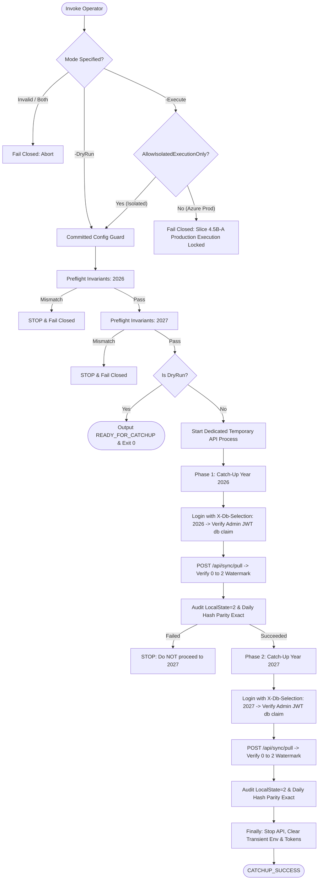

# Slice 4.5B-A — Controlled Production Catch-Up Operator & Dry-Run Readiness

## Executive Summary
This document provides the operational architecture, safety boundaries, and verification evidence for **Slice 4.5B-A: Controlled Production Catch-Up Operator & Dry-Run** in `AlexandriaDeveloper/IProgram2`.

The operator tool (`script/sync-rollout/execute_daily_pull_catchup.ps1`) is designed to execute the first production Daily Pull catch-up in a strictly controlled, fail-closed, observable manner. In accordance with Slice 4.5B-A invariants, **zero live production pull execution** is performed during this phase. Only `-DryRun` has been executed against production connections, while `-Execute` has been tested and verified end-to-end solely within an isolated local SQL Server test harness.

---

## 1. Architectural Principles & Safety Invariants

### 1.1 Strict Prohibition of Naive Scripting
Production state convergence must **never** be achieved by manual database patches:
* **NO direct SQL checkpoint increments** (`UPDATE sync.LocalState SET LastServerVersion = 2`).
* **NO synthetic DML bypasses** or out-of-band state doctoring.
* **NO ad-hoc test harness calls** against production.
* **MANDATORY Production Code Path:** Catch-up execution strictly runs through:
  $$\text{Admin HTTP Request} \longrightarrow \text{POST /api/sync/pull} \longrightarrow \text{LocalDailyPullService} \longrightarrow \text{AzureFencedBatchReader} \longrightarrow \text{LocalPullTransactionCoordinator}$$
  using the standard Dependency Injection container and transaction guarantees.

### 1.2 Dedicated Transient API Process
To eliminate interference with standard production operations and prevent external exposure:
1. **Loopback Isolation:** The operator starts a dedicated, temporary ASP.NET Core API process bound exclusively to `http://127.0.0.1:<port>`.
2. **Zero File Mutations:** The operator **never** modifies `appsettings.json` or `appsettings.Development.json`.
3. **Transient Environment Overrides:** Runtime flags are supplied only via process-level environment variables during execution:
   ```text
   Sync__PullEnabled = true
   Sync__PushEnabled = false
   Sync__AuthoritativeTrackingEnabled = false
   LocalFirst__Enabled = false
   LocalFirst__ReadOnlyMode = false
   ```
4. **Deterministic Teardown:** In all execution paths (`try ... finally`), the dedicated process is terminated, and all transient environment variables and in-memory tokens are immediately cleared.

---

## 2. Execution Model & Verification Stages

The operator script enforces two strictly mutually exclusive modes: `-DryRun` and `-Execute`.



### 2.1 Sequential Single-Year Progression
Execution proceeds strictly one year at a time:
1. **Phase 1 (2026):** Full preflight, token issuance, catch-up pull, and post-pull audit.
2. **Hard Halt Boundary:** If any assertion in Phase 1 fails, execution halts immediately with error. **Phase 2 is not initiated.**
3. **Phase 2 (2027):** Executes only after Phase 1 has completely committed and passed all audits.

---

## 3. Preflight & Post-Catchup Invariants

### 3.1 Preflight Invariants (Current Production State)
Before any catch-up execution is permitted, both years must independently satisfy:

| Component | Target Invariant | Purpose |
| :--- | :--- | :--- |
| **Azure `sync.ServerState`** | `CurrentVersion == 2` | Ensures authoritative baseline matches cutover canary |
| **Azure `sync.ServerChangeFeed`** | Exactly 2 records (`v1 INSERT`, `v2 HARD_DELETE`) | Validates complete canary lifecycle with `OriginDeviceId = Guid.Empty` |
| **Azure `sync.Tombstones`** | Exactly 1 record (`v2 Daily`) | Verifies terminal deletion tombstone for canary |
| **Azure `sync.ProcessedOperations`**| Exactly 0 records | Confirms zero un-synchronized outbox client operations |
| **Azure `dbo.Daily`** | Canary record is completely absent | Confirms canary row was physically deleted |
| **Local `sync.LocalState`** | `LastServerVersion == 0` | Guarantees clean catch-up baseline from version 0 |
| **Local Sync Lease** | `ActiveLeaseToken` is NULL or expired | Prevents concurrent push or pull lease acquisition |
| **Local `sync.LocalOutbox`** | Blockers (`PENDING`, `IN_PROGRESS`, `FAILED`) == 0 | Ensures no local transactions are pending synchronization |
| **Daily Deterministic Parity** | SHA-256 hash match between Azure and Local | 100% exact parity across all business columns |
| **Row Counts** | 2026: 30 rows / 2027: 14 rows | Preserves operational business baseline |

### 3.2 Expected Allowed Local Mutations
During actual catch-up execution:
1. `LocalState.LastServerVersion`: Advances monotonically from `0` to `2`.
2. `LocalState.LastSuccessfulPullUtc`: Updated to execution timestamp.
3. `LocalState.LastSyncAttemptUtc`: Updated to execution timestamp.
4. `LocalState.LastSyncError`: Cleared (`NULL`).
5. `LocalState` Lease Token acquired and released.
6. Local terminal delete execution for the canary row: Executes with `affectedRows = 0` (since canary never existed locally) and is reported as `NO_OP`.
7. **Business Invariant:** `dbo.Daily` SHA-256 deterministic hash is **100% identical before and after catch-up**. Row counts remain exactly 30 (2026) and 14 (2027).

### 3.3 Azure Invariant: Strictly Read-Only
During and after pull execution, Azure SQL Database is strictly read-only:
* **Zero INSERT, UPDATE, DELETE, MERGE, or DDL statements.**
* `UPDLOCK, HOLDLOCK` fence held transiently during batch read.
* Azure `CurrentVersion` remains exactly 2.

---

## 4. Rollback Philosophy

### Pull Checkpoint Monotonicity
The pull synchronization engine is architected as an idempotent, monotonic state-convergence protocol. 

> [!CAUTION]
> **NO MANUAL ROLLBACK:** If a pull commits locally on Year 2026 (advancing `LastServerVersion = 0 -> 2`) and an error subsequently occurs (e.g., during Year 2027), **manual rollback via `UPDATE sync.LocalState SET LastServerVersion = 0` is strictly forbidden.**
> 
> Reverting the watermark would cause subsequent pull attempts to re-evaluate already processed feed events against local state that may have advanced, violating serializability. The operator script records exact telemetry and halts closed for diagnostic analysis.

---

## 5. Security & Credential Isolation

1. **Environment-Only Secrets:** Operator credentials (`IPROGRAM_OPERATOR_USERNAME`, `IPROGRAM_OPERATOR_PASSWORD`) are injected exclusively via transient environment variables.
2. **Zero Leakage Invariant:** 
   - No passwords or tokens are committed, echoed to stdout/stderr, written to temporary files, or recorded in audit artifacts.
   - JWT tokens are decoded locally without emitting the raw bearer string.
3. **JWT Authorization Authority:**
   - The operator authenticates against `/api/account/login` supplying `X-Db-Selection: <Year>`.
   - The resulting JWT contains the authoritative `db` claim.
   - The operator validates `role == 'Admin'`, `db == <targetYear>`, and expiration locally prior to dispatching `POST /api/sync/pull`.
   - No request body overrides or query parameters can override the database selection bound within the token.

---

## 6. Verification Evidence

### 6.1 Production Dry-Run Evidence (Slice 4.5B-A)
Executed command:
```powershell
.\script\sync-rollout\execute_daily_pull_catchup.ps1 -DryRun
```
* **Committed Configuration Invariant:** Verified all committed flags in `appsettings.json` and `appsettings.Development.json` are `false`.
* **Year 2026 Preflight Status:**
  - Azure `CurrentVersion == 2`: `PASS`
  - ChangeFeed `v1 INSERT` + `v2 HARD_DELETE`: `PASS`
  - Tombstone Count `== 1` (matching canary): `PASS`
  - `ProcessedOperations == 0`: `PASS`
  - Local `LastServerVersion == 0`: `PASS`
  - LocalOutbox Blockers `== 0`: `PASS`
  - Daily Parity: `30 rows`, deterministic SHA-256 hash match: `PASS`
  - Year 2026 Readiness: `READY_FOR_CATCHUP`
* **Year 2027 Preflight Status:**
  - Azure `CurrentVersion == 2`: `PASS`
  - ChangeFeed `v1 INSERT` + `v2 HARD_DELETE`: `PASS`
  - Tombstone Count `== 1` (matching canary): `PASS`
  - `ProcessedOperations == 0`: `PASS`
  - Local `LastServerVersion == 0`: `PASS`
  - LocalOutbox Blockers `== 0`: `PASS`
  - Daily Parity: `14 rows`, deterministic SHA-256 hash match: `PASS`
  - Year 2027 Readiness: `READY_FOR_CATCHUP`
* **Overall Status:** `DRY_RUN_PASSED`
* **Operational Invariant:** Zero API calls, zero database mutations, pure read-only audit.

### 6.2 Isolated End-to-End Execute Evidence
Executed command:
```powershell
.\script\sync-rollout\test_execute_daily_pull_catchup_isolated.ps1
```
* **Dedicated Temporary API Process:** Launched on alternate loopback port (`5103`) with transient sync flags.
* **Phase 1 Catch-Up (2026):**
  - Authentication: Admin JWT issued with claim `db = 2026`.
  - Pull Execution: `POST /api/sync/pull` completed with `previousWatermark = 0`, `finalServerVersion = 2`, `isNoOp = false`.
  - Local Checkpoint: Verified `sync.LocalState` advanced from `0 -> 2`.
  - Business Data: Deterministic SHA-256 hash remained 100% identical before and after pull (30 rows).
* **Phase 2 Catch-Up (2027):**
  - Authentication: Admin JWT issued with claim `db = 2027`.
  - Pull Execution: `POST /api/sync/pull` completed with `previousWatermark = 0`, `finalServerVersion = 2`, `isNoOp = false`.
  - Local Checkpoint: Verified `sync.LocalState` advanced from `0 -> 2`.
  - Business Data: Deterministic SHA-256 hash remained 100% identical before and after pull (14 rows).
* **Idempotent Retry Proof (NO-OP):**
  - Calling `POST /api/sync/pull` on caught-up databases (watermark = 2) returned:
    `previousWatermark = 2, finalServerVersion = 2, isNoOp = true`.
  - Deterministic hashes unchanged.
* **Operator Fail-Closed Guard Proof:**
  - Invoking operator script against caught-up databases triggered preflight rejection:
    `PREFLIGHT_FAIL: Local LastServerVersion for 2026 is 2 (Expected: 0)`.
* **Sanitization:** Zero passwords or tokens logged or leaked during execution.
