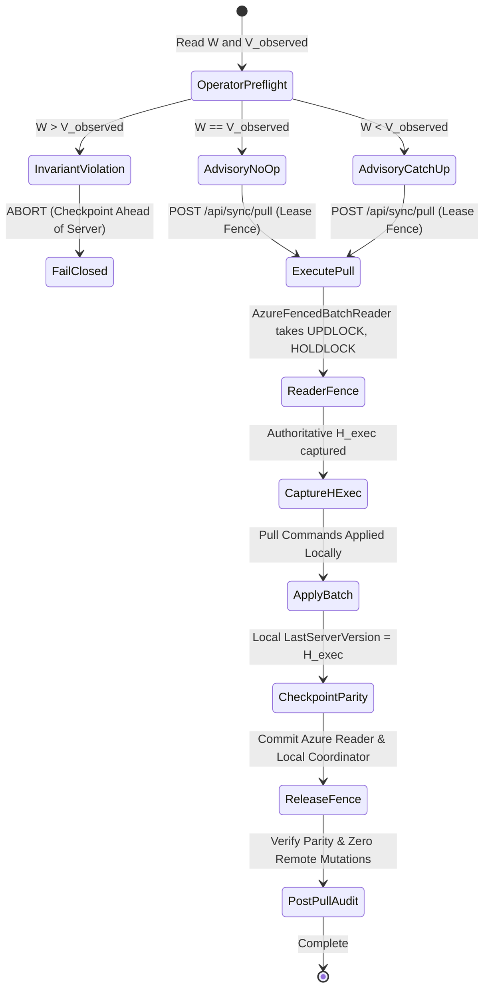

# Slice 4.5B-2 — Dynamic Catch-Up Operator Design & Verification

## Executive Summary
This document defines the architectural design, safety boundaries, and verification evidence for **Slice 4.5B-2: Dynamic Catch-Up Operator Refactor** in `AlexandriaDeveloper/IProgram2`.

Slice 4.5B-2 supersedes the historical canary-specific assumptions in PR #29 by implementing a dynamic, observable runtime model for the controlled Daily Pull catch-up operator (`script/sync-rollout/execute_daily_pull_catchup.ps1`).

---

## 1. Architectural Motivation & Distinctions

PR #29 was implemented against an early canary-testing phase when Azure change feed tracking was dormant and only a synthetic canary event sequence was present. Consequently, PR #29 contained several assumptions incompatible with the active production master:

| Architectural Concern | Historical PR #29 (Slice 4.5B-A) | Slice 4.5B-2 Dynamic Model |
| :--- | :--- | :--- |
| **Committed Baseline** | Required `AuthoritativeTrackingEnabled = false` | Requires `AuthoritativeTrackingEnabled = true` (safe baseline for Online writes) |
| **Watermark Model** | Hardcoded $W = 0 \rightarrow 2$ | Dynamic $(W, V_{observed}, H_{exec})$ state machine |
| **Server Version** | Required $V_{target} = 2$ exactly | Accepts any valid $V_{observed} \ge W$ and fences $H_{exec}$ |
| **Feed Event Assumptions** | Required exactly 2 events (INSERT $\rightarrow$ HARD_DELETE) | Dynamic $(W, H_{exec}]$ window with sequence continuity |
| **Row Count Assumptions** | Fixed 30 rows (2026) / 14 rows (2027) | Dynamic row counts and dynamic entity parity verification |
| **Parity State** | Mismatch if $W > 0$ | $W == H_{exec}$ reports deterministic NO-OP (0 business mutations) |
| **Concurrent Version Advances** | Failed if remote advanced | Authoritative writer blocked under reader fence; newer versions belong to subsequent pull |
| **Invariant Violation** | Error on non-canary versions | Fails closed with `INVARIANT_VIOLATION_CHECKPOINT_AHEAD_OF_SERVER` if $W > V_{observed}$ |

---

## 2. Dynamic Semantic Model: $V_{observed}$ vs. $H_{exec}$

To prevent ambiguity between operator preflight observations and authoritative database execution fences, the operator and test harnesses distinguish two versions:

1. **$V_{observed}$ (Advisory Preflight Version):**
   - Read-only advisory version observed by the operator during its preflight SQL inspection (`[sync].[ServerState].[CurrentVersion]`).
   - Used for preflight sanity validation ($W \le V_{observed}$ required).
   - If $W > V_{observed}$, the operator immediately fails closed before invoking any API endpoints.
2. **$H_{exec}$ (Authoritative Execution Fence):**
   - Authoritative execution HighWatermark captured by `AzureFencedBatchReader` inside a `SERIALIZABLE` transaction with `SELECT CurrentVersion FROM [sync].[ServerState] WITH (UPDLOCK, HOLDLOCK)`.
   - The pull applies exactly $H_{exec}$.
   - Local checkpoint after success equals exactly $H_{exec}$.
   - Any concurrent authoritative writer attempting to advance `ServerState` after $H_{exec}$ is fenced is deterministically blocked by the SQL Server lock manager until the reader releases the fence (transaction commit).
   - If remote advanced *before* the reader acquired its fence, that newer version is legitimately part of the current $H_{exec}$ ($H_{exec} \ge V_{observed}$).

---

## 3. Deterministic Locking Proof

The concurrency invariant is proven using deterministic SQL Server dynamic management views (`sys.dm_os_waiting_tasks`) rather than flaky timing sleeps:
- **Reader Fence:** Starts a `SERIALIZABLE` transaction and acquires an update lock with holdlock on the canonical `[sync].[ServerState]` row.
- **Concurrent Writer:** Attempts an update to `[sync].[ServerState]` on a separate connection.
- **Verification:** Polling `sys.dm_os_waiting_tasks` confirms the writer is actively blocked by the reader's SPID on a lock wait (`LCK_M_U` or `LCK_M_X`).
- **Invariance:** While the writer is blocked, `CurrentVersion` remains unchanged at $H_{exec}$.
- **Release & Advance:** Once the reader commits, the writer unblocks and commits version $H_{exec} + 1$. The subsequent pull attempt advances local to $H_{exec} + 1$.

---

## 4. Configuration & Isolation Safeguards

### 4.1 Committed Configuration Guard
The operator verifies that repository configuration files maintain:
- `Sync:AuthoritativeTrackingEnabled = true` (mandatory for safe online write tracking).
- `Sync:PullEnabled = false`.
- `Sync:PushEnabled = false`.
- `LocalFirst:Enabled = false`.
- `LocalFirst:ReadOnlyMode = false`.

### 4.2 Physical Database Isolation
- In test environments (`ASPNETCORE_ENVIRONMENT == "Testing"`):
  - `IsolatedTestRemoteDatabaseConnectionFactory` resolves `TestRemoteConnection2026` / `TestRemoteConnection2027` and fails closed if missing.
  - Zero fallback to `DefaultConnection` or production databases (`IProgramDb2026`, `IProgramDb2027`, `IProgramLocalDb2026`, `IProgramLocalDb2027`).

---

## 5. Automated Verification Matrix

The isolated test suite (`script/sync-rollout/test_execute_daily_pull_catchup_isolated.ps1`) verifies all required scenarios:

| Scenario | Description | Evidence / Result |
| :--- | :--- | :--- |
| **Test 1** | Committed Configuration Guard against master baseline | **PASS** (`AuthoritativeTrackingEnabled = true` accepted) |
| **Test 2** | Invariant check $W > V_{observed}$ fails closed | **PASS** (Non-zero exit code + exact error marker verified) |
| **Test 3** | Dynamic preflight Dry-Run on multi-version non-canary dataset | **PASS** (`NEEDS_CATCH_UP`, $W=0, V_{observed}=4$ verified) |
| **Test 4** | Full Catch-Up execution ($W = 0 \rightarrow H_{exec}=4$) | **PASS** (Local checkpoints advanced to 4, exact entity parity) |
| **Test 5** | Idempotent retry ($W == V_{observed} == 4$) deterministic NO-OP | **PASS** (`IsNoOp=True`, 0 business data mutations, hash unchanged) |
| **Test 6** | Partial catch-up ($W = 4 \rightarrow 6$) progression | **PASS** (Local checkpoints advanced to 6 cleanly) |
| **Test 7** | Concurrent Authoritative Advance Blocked Under Reader Fence | **PASS** (DMV locking evidence: writer blocked by reader SPID on `LCK`) |
| **Test 8** | Teardown & Transient Database Cleanup | **PASS** (Databases dropped cleanly) |
