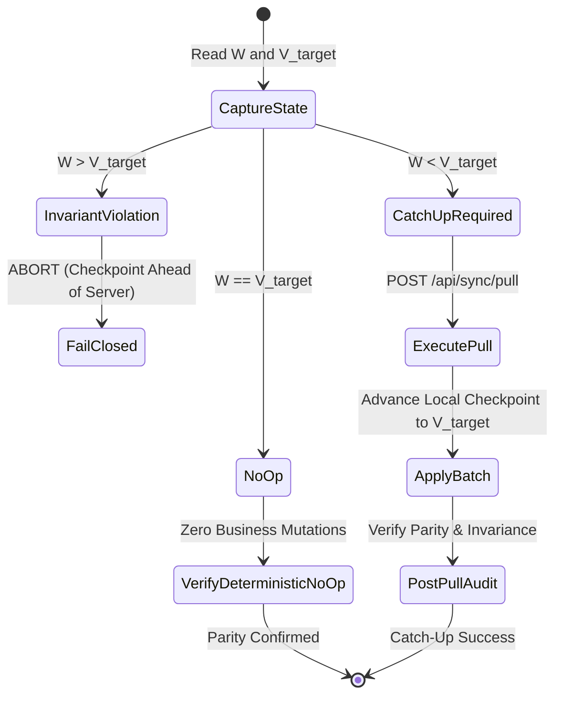

# Slice 4.5B-2 — Dynamic Catch-Up Operator Design & Verification

## Executive Summary
This document defines the architectural design, safety boundaries, and verification evidence for **Slice 4.5B-2: Dynamic Catch-Up Operator Refactor** in `AlexandriaDeveloper/IProgram2`.

Slice 4.5B-2 supersedes the historical, canary-specific assumptions in PR #29 by implementing a fully dynamic runtime model for the controlled Daily Pull catch-up operator (`script/sync-rollout/execute_daily_pull_catchup.ps1`).

---

## 1. Architectural Motivation & Differences from PR #29

PR #29 was implemented against an early phase when Azure change feed tracking was dormant and only a synthetic canary event sequence was present. Consequently, PR #29 contained several assumptions incompatible with the current production master:

| Architectural Concern | Historical PR #29 (Slice 4.5B-A) | Slice 4.5B-2 Dynamic Model |
| :--- | :--- | :--- |
| **Committed Baseline** | Required `AuthoritativeTrackingEnabled = false` | Requires `AuthoritativeTrackingEnabled = true` (safe baseline for Online writes) |
| **Watermark Target** | Hardcoded $W = 0 \rightarrow 2$ | Dynamic $(W, V_{target})$ state machine |
| **Server Version** | Required $V_{target} = 2$ exactly | Accepts any valid $V_{target} \ge W$ |
| **Feed Event Assumptions** | Required exactly 2 events (INSERT $\rightarrow$ HARD_DELETE) | Dynamic $(W, V_{target}]$ window with sequence continuity |
| **Row Count Assumptions** | Fixed 30 rows (2026) / 14 rows (2027) | Dynamic row counts and dynamic entity parity verification |
| **Parity State** | Mismatch if $W > 0$ | $W == V_{target}$ reports deterministic NO-OP (0 business mutations) |
| **Concurrent Version Advances** | Failed if remote advanced | Local stops cleanly at captured $V_{target}$; newer versions belong to subsequent attempt |
| **Invariant Violation** | Error on non-canary versions | Fails closed with `INVARIANT_VIOLATION_CHECKPOINT_AHEAD_OF_SERVER` if $W > V_{target}$ |

---

## 2. Dynamic $(W, V_{target})$ Semantic Model

Let $W$ be the local checkpoint version ($[sync].[LocalState].[LastServerVersion]$) and $V_{target}$ be the remote version captured at the start of the attempt ($[sync].[ServerState].[CurrentVersion]$).

### 2.1 State Transitions
1. **$W > V_{target}$ (Invariant Violation):**
   - Local state is ahead of remote. This indicates split-brain or manual corruption.
   - **Action:** FAIL CLOSED immediately before executing any network calls.
2. **$W == V_{target}$ (Deterministic NO-OP):**
   - Local state is already at parity with remote.
   - **Action:** Report NO-OP. Call `/api/sync/pull` under lease fence; server confirms `IsNoOp = true` with zero business mutations.
3. **$W < V_{target}$ (Catch-Up Required):**
   - Local is behind by $\Delta = V_{target} - W$ version(s).
   - **Action:** Acquire atomic lease, read feed window $(W, V_{target}]$, coalesce operations, apply batch in local transaction, and advance local checkpoint to $V_{target}$.

---

## 3. Configuration & Isolation Safeguards

### 3.1 Committed Configuration Guard
The operator enforces that repository configuration files (`src/Api/appsettings.json` and `src/Api/appsettings.Development.json`) maintain:
- `Sync:AuthoritativeTrackingEnabled = true` (mandatory for safe online write tracking).
- `Sync:PullEnabled = false`.
- `Sync:PushEnabled = false`.
- `LocalFirst:Enabled = false`.
- `LocalFirst:ReadOnlyMode = false`.

### 3.2 Physical Database Isolation
- In test environments (`ASPNETCORE_ENVIRONMENT == "Testing"`):
  - `IsolatedTestRemoteDatabaseConnectionFactory` resolves `TestRemoteConnection2026` / `TestRemoteConnection2027` and fails closed if missing.
  - Zero fallback to `DefaultConnection` or `CON2027`.
  - Zero production database names (`IProgramDb2026`, `IProgramDb2027`, `IProgramLocalDb2026`, `IProgramLocalDb2027`) permitted.

---

## 4. Automated Verification Matrix

The isolated test harness (`script/sync-rollout/test_execute_daily_pull_catchup_isolated.ps1`) verifies all required scenarios end-to-end:

| Scenario | Description | Result |
| :--- | :--- | :--- |
| **Test 1** | Committed Configuration Guard against master baseline | **PASS** |
| **Test 2** | Invariant check $W > V_{target}$ fails closed | **PASS** |
| **Test 3** | Dynamic preflight Dry-Run on multi-version non-canary dataset | **PASS** |
| **Test 4** | Full Catch-Up execution ($W = 0 \rightarrow 4$) with non-canary sequence | **PASS** |
| **Test 5** | Idempotent retry ($W == V_{target} == 4$) deterministic NO-OP | **PASS** |
| **Test 6** | Partial catch-up ($W = 4 \rightarrow 6$) multi-version progression | **PASS** |
| **Test 7** | Clean teardown of all isolated test databases | **PASS** |
