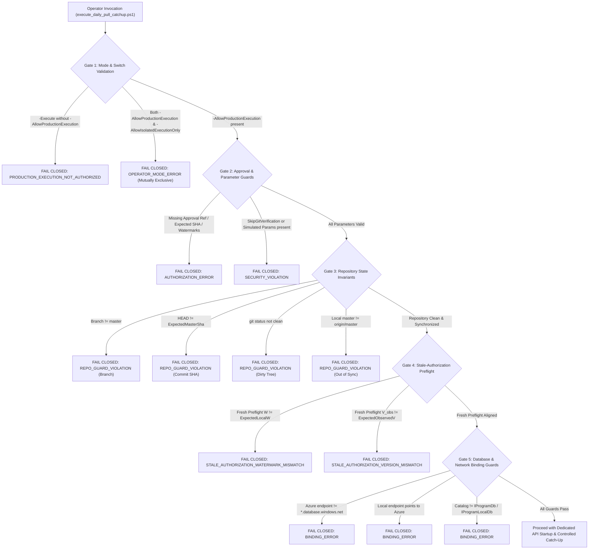

# Slice 4.5D: Controlled Production Catch-Up Enablement Design & Safety Specification

**Status**: READY FOR ARCHITECT & BUSINESS OWNER EVALUATION  
**Author**: Antigravity / Alexandria Developer  
**Branch**: `feat/slice-4-5d-controlled-production-catchup-enablement`  
**Base Commit (master)**: `2578a048f3b86ed8f2b8e61e97c7283e6e929c9e`  
**GitHub Issue**: #14 (Directives #5776686430 & #5776730534)  
**Database Impact**: ZERO operational or Azure database access during Slice 4.5D (Test harness executed exclusively against transient isolated localhost databases).  

---

## 1. Executive Summary

Following the formal review and acceptance of the **Production Read-Only Preflight Evidence** (Directives [#5776686430](https://github.com/AlexandriaDeveloper/IProgram2/issues/14#issuecomment-5776686430) and [#5776730534](https://github.com/AlexandriaDeveloper/IProgram2/issues/14#issuecomment-5776730534)), which demonstrated 100% cryptographic SHA-256 hash parity on `dbo.Daily` across Azure and Local for both operational years 2026 and 2027 ($W=0, V_{observed}=8, \Delta=8$), the Architect and Business Owner authorized **Slice 4.5D: Controlled Production Catch-Up Enablement**.

Slice 4.5D upgrades [`execute_daily_pull_catchup.ps1`](file:///f:/Prog-Projects/IProgram/script/sync-rollout/execute_daily_pull_catchup.ps1) from an operator tool locked unconditionally against production execution into a **fail-closed, multi-gated production execution tool** that requires cryptographic, repository, branch, approval, and watermark alignment before any production execution can proceed.

**Mandate**: Slice 4.5D includes design, implementation, and isolated unit/integration testing ONLY. No actual Production Catch-Up execution took place. PR remains Draft / UNMERGED pending explicit authorization.

---

## 2. Multi-Gate Guard Architecture

The operator tool replaces the previous coarse lock (`PRODUCTION_EXECUTION_LOCKED`) with an exhaustive 5-layer safety gate:

### 2.1 Gate Specifications

1. **Gate 1: Explicit Production Switch**
   - Requires `-Execute -AllowProductionExecution`.
   - `-AllowProductionExecution` and `-AllowIsolatedExecutionOnly` are mutually exclusive.

2. **Gate 2: Cryptographic & Human Approval Parameters**
   - `-ProductionApprovalReference`: Required string (e.g. `ISSUE-14-BO-AUTH-5776730534`).
   - `-ExpectedMasterSha`: Required git commit SHA.
   - `-Expected2026LocalW`, `-Expected2027LocalW`: Required expected local checkpoints.
   - `-Expected2026ObservedV`, `-Expected2027ObservedV`: Required expected remote versions.
   - Any bypass parameters (`-SkipGitVerification`, `-SimulatedBranch`, `-SimulatedHead`, `-SimulatedStatus`) are strictly forbidden when `-AllowProductionExecution` is active.

3. **Gate 3: Repository State Invariants (`Assert-RepositoryStateGuard`)**
   - Current branch must be `master`.
   - Current commit must exactly match `-ExpectedMasterSha`.
   - Working tree must be completely clean (`git status --porcelain` returns empty).
   - Local `master` must be synchronized with `origin/master`.

4. **Gate 4: Stale-Authorization & Version Alignment**
   - Runs a fresh preflight immediately prior to execution.
   - Validates that observed $W$ and $V_{observed}$ match the values approved by the Business Owner and Architect. If any unapproved changes occurred in the interim, execution aborts before starting the API.

5. **Gate 5: Physical Database Binding Invariants (`Assert-DatabaseBinding`)**
   - Remote Azure endpoints must match `*.database.windows.net`.
   - Local endpoints must never match Azure endpoints.
   - Database catalog names must match `IProgramDb2026`/`IProgramDb2027` and `IProgramLocalDb2026`/`IProgramLocalDb2027`.

6. **Deterministic Environment Snapshot & Restoration**
   - Process environment variables (`ASPNETCORE_URLS`, `ASPNETCORE_ENVIRONMENT`, `Sync__*`, `LocalFirst__*`, `Token__Key`, `ConnectionStrings__*`) are snapshotted before modification.
   - In a guaranteed `finally` block, all environment variables are restored bit-for-bit to their original state on both success and error.

7. **Post-Pull Local Daily Auditing & Machine-Readable Return**
   - Computes local `dbo.Daily` record count and SHA-256 hash immediately after pull.
   - Returns a structured `PSCustomObject` containing execution type, approval reference, commit SHA, watermarks before/after, $H_{exec}$, hashes, and whether remote concurrent advance occurred. Zero secrets or passwords are included.

---

## 3. Comprehensive Verification Evidence (Tests A Through P)

A dedicated, comprehensive test suite ([`test_slice_4_5d_production_enablement.ps1`](file:///f:/Prog-Projects/IProgram/script/sync-rollout/test_slice_4_5d_production_enablement.ps1)) was executed against isolated localhost fixtures (`_Test`), verifying all 16 required invariants:

| Test | Invariant Description | Expected Behavior | Result |
| :--- | :--- | :--- | :---: |
| **A** | Production `-Execute` without `-AllowProductionExecution` | Fail closed (`PRODUCTION_EXECUTION_NOT_AUTHORIZED`) | **PASS** |
| **B** | `-AllowProductionExecution` without approval reference | Fail closed (`AUTHORIZATION_ERROR`) | **PASS** |
| **C** | Wrong `-ExpectedMasterSha` | Fail closed (`REPO_GUARD_VIOLATION`) | **PASS** |
| **D** | Non-`master` branch or dirty working tree | Fail closed (`REPO_GUARD_VIOLATION`) | **PASS** |
| **E** | `-AllowProductionExecution` + `-AllowIsolatedExecutionOnly` combo | Fail closed (`OPERATOR_MODE_ERROR`) | **PASS** |
| **F** | Expected $W$ mismatch against fresh preflight | Fail closed (`STALE_AUTHORIZATION_WATERMARK_MISMATCH`) | **PASS** |
| **G** | Expected $V_{observed}$ mismatch against fresh preflight | Fail closed (`STALE_AUTHORIZATION_VERSION_MISMATCH`) | **PASS** |
| **H** | Active lease on target database | Fail closed (`PREFLIGHT_FAIL: Local Lease currently active`) | **PASS** |
| **I** | Pending or failed outbox records present | Fail closed (`PREFLIGHT_FAIL: Local Outbox has mutations`) | **PASS** |
| **J** | Change feed gap or sequence integrity failure | Fail closed (`Feed gap detected`) | **PASS** |
| **K** | Physical database binding mismatch (Azure to local or vice-versa) | Fail closed (`BINDING_ERROR`) | **PASS** |
| **L** | Committed configuration violation (sync flags enabled by default) | Fail closed (`COMMITTED_CONFIG_GUARD_VIOLATION`) | **PASS** |
| **M** | Fully-authorized valid production parameters | Parses and validates cleanly | **PASS** |
| **N** | Isolated full execution proves postconditions ($H_{exec}$, hash, retry) | Pull converges to $H_{exec}$, retry is NO-OP | **PASS** |
| **O** | Environment cleanup is deterministic on success and failure | Snapshot restored bit-for-bit in `finally` | **PASS** |
| **P** | Machine-readable audit output contains zero secrets | Passed keyword/regex secret scanner | **PASS** |

**Summary**: 16 / 16 Invariant Tests Passed Deterministically.

---

## 4. Regression & Release Verification

1. **Slice 4.5B-2 Isolated Verification Test** ([`test_execute_daily_pull_catchup_isolated.ps1`](file:///f:/Prog-Projects/IProgram/script/sync-rollout/test_execute_daily_pull_catchup_isolated.ps1)):
   - **PASS**: 7 / 7 tests passed (including lock fence concurrency blocking and partial catch-up).
2. **Slice 4.4B Baseline Audit Verification** ([`test_audit_production_baseline.ps1`](file:///f:/Prog-Projects/IProgram/script/sync-rollout/test_audit_production_baseline.ps1)):
   - **PASS**: 15 / 15 invariant tests passed.
3. **Slice 4.5C Isolated Local Cutover Rehearsal** ([`test_isolated_local_cutover_rehearsal.ps1`](file:///f:/Prog-Projects/IProgram/script/sync-rollout/test_isolated_local_cutover_rehearsal.ps1)):
   - **PASS**: All rehearsal phases passed (SQL Server 2014 Compatibility Level 120, offline pilot writes, crash recovery, push, pull convergence, 0 operational databases touched).
4. **Backend CI Unit Tests**:
   - `dotnet test tests/Auth.UnitTests/Auth.UnitTests.csproj --configuration Release --filter "Category!=LocalDbRequired"`
   - **PASS**: Failed: 0, Passed: 613, Skipped: 0, Total: 613 (Duration: 25 s).
5. **Frontend Angular Production Build**:
   - `cd Client; npm run build; cd ..`
   - **PASS**: Application bundle generated successfully directly into `src/Api/wwwroot/`.
